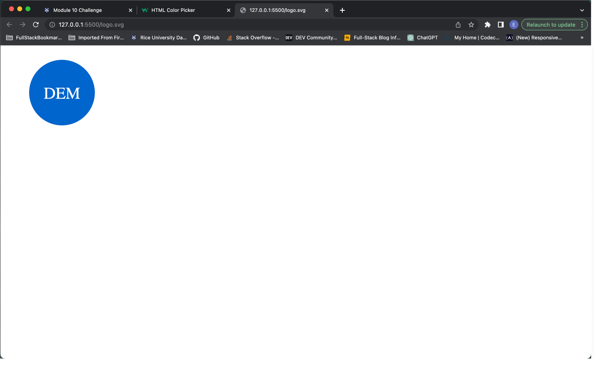

# mod-10-svg-logo-maker

## 

## Description
* For this project, I will create an application that will enable a user to create a svg logo.
* This application will feature Node.js and use npm dependencies inquirer and jest.
* I will also test the application using jest and make sure that it passes the test.
* I will make sure that my code follows industry standards and is sourced correctly.
* By building this application, it has helped me to learn information on Node.js, npm, jest, svg, and other info.
## User Story
AS a freelance web developer
I WANT to generate a simple logo for my projects
SO THAT I don't have to pay a graphic designer
## Acceptance Criteria
GIVEN a command-line application that accepts user input
WHEN I am prompted for text
THEN I can enter up to three characters
WHEN I am prompted for the text color
THEN I can enter a color keyword (OR a hexadecimal number)
WHEN I am prompted for a shape
THEN I am presented with a list of shapes to choose from: circle, triangle, and square
WHEN I am prompted for the shape's color
THEN I can enter a color keyword (OR a hexadecimal number)
WHEN I have entered input for all the prompts
THEN an SVG file is created named `logo.svg`
AND the output text "Generated logo.svg" is printed in the command line
WHEN I open the `logo.svg` file in a browser
THEN I am shown a 300x200 pixel image that matches the criteria I entered

## Sources

* Parameters for basic shapes: https://developer.mozilla.org/en-US/docs/Web/SVG/Tutorial/Basic_Shapes
* npm modules: https://www.npmjs.com/
* Hexadecimal color codes: https://www.w3schools.com/colors/colors_picker.asp 
* Reused similar code from last homework: https://github.com/douglasmarsalis/mod-9-pro-readme-gen
* Code ideas: https://github.com/rmessett15/SVG-Logo-Maker/tree/main
* svg data: https://www.w3.org/TR/SVG/
* Node documentation: https://nodejs.org/docs/latest-v4.x/api/fs.html#fs_fs_writefile_file_data_options_callback
* Svg Tutorial: https://developer.mozilla.org/en-US/docs/Web/SVG/Tutorial
* Special thanks to my tutor Ben.
## Link to Deployed Site

There is no deployed site for this application.
## Link to Github Repository

https://github.com/douglasmarsalis/mod-10-svg-logo-maker
## Screenshots and Video

[svg_logo_create.webm](https://github.com/douglasmarsalis/mod-10-svg-logo-maker/assets/112460009/d6710783-98f0-4f1a-9bf1-399312d76f2d)

[shapes_test_vid.webm](https://github.com/douglasmarsalis/mod-10-svg-logo-maker/assets/112460009/133ce565-441a-4ec8-a531-3377ffe09d60)

## License
MIT License

Copyright (c) 2023 Douglas Eric Marsalis

Permission is hereby granted, free of charge, to any person obtaining a copy
of this software and associated documentation files (the "Software"), to deal
in the Software without restriction, including without limitation the rights
to use, copy, modify, merge, publish, distribute, sublicense, and/or sell
copies of the Software, and to permit persons to whom the Software is
furnished to do so, subject to the following conditions:

The above copyright notice and this permission notice shall be included in all
copies or substantial portions of the Software.

THE SOFTWARE IS PROVIDED "AS IS", WITHOUT WARRANTY OF ANY KIND, EXPRESS OR
IMPLIED, INCLUDING BUT NOT LIMITED TO THE WARRANTIES OF MERCHANTABILITY,
FITNESS FOR A PARTICULAR PURPOSE AND NONINFRINGEMENT. IN NO EVENT SHALL THE
AUTHORS OR COPYRIGHT HOLDERS BE LIABLE FOR ANY CLAIM, DAMAGES OR OTHER
LIABILITY, WHETHER IN AN ACTION OF CONTRACT, TORT OR OTHERWISE, ARISING FROM,
OUT OF OR IN CONNECTION WITH THE SOFTWARE OR THE USE OR OTHER DEALINGS IN THE
SOFTWARE.
